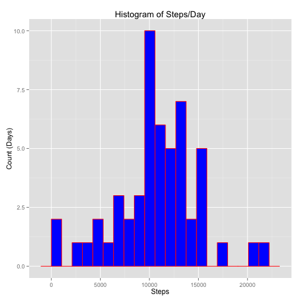
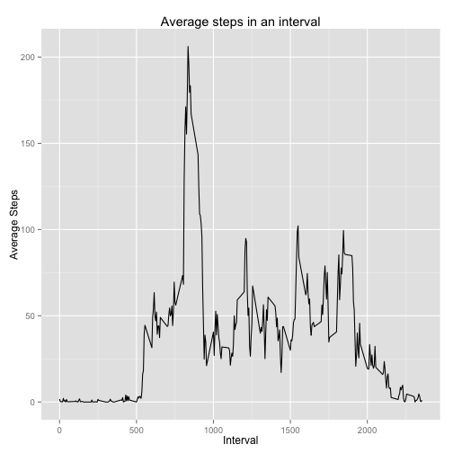
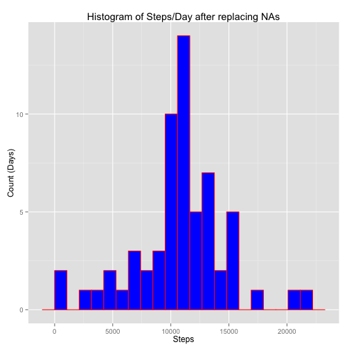
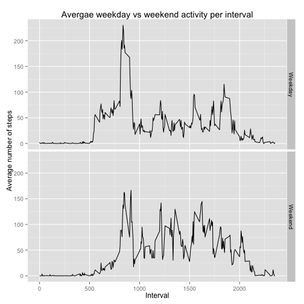

Peer Assessment-1 (Activity Monitoring)
==============================
## Loading and pre-processing the Activity Monitoring Data. 
Following steps are done in preprocessing

- Unzipped the file using unzip command

- Loaded CSV file "activity.csv" using read.csv command into data frame Data.Activity


```r
setwd(DataDir)
if(!file.exists("activity.csv")){unzip("activity.zip")}
Data.Activity=read.csv("activity.csv")
Data.Activity$interval=as.factor(Data.Activity$interval)
summary(Data.Activity)
```

```
##      steps                date          interval    
##  Min.   :  0.00   2012-10-01:  288   0      :   61  
##  1st Qu.:  0.00   2012-10-02:  288   5      :   61  
##  Median :  0.00   2012-10-03:  288   10     :   61  
##  Mean   : 37.38   2012-10-04:  288   15     :   61  
##  3rd Qu.: 12.00   2012-10-05:  288   20     :   61  
##  Max.   :806.00   2012-10-06:  288   25     :   61  
##  NA's   :2304     (Other)   :15840   (Other):17202
```
It is observed that there are three variables in the data i.e., steps, date and interval. Also there are "NA"s in the variable "steps".


```r
Data.Activity.NoNA=Data.Activity[complete.cases(Data.Activity$steps),]
library(plyr)
Steps.Day.Summary=ddply(Data.Activity.NoNA,"date",summarise,Total.Steps.InDay=sum(steps))
#print(Steps.Day.Summary)
A=as.table(summary(Steps.Day.Summary$Total.Steps))
binwidth=(A[6]-A[1])/20#(Max-Min)/200
```
## To plot histogram and reporting mean and median

```r
library(ggplot2)
qplot(Steps.Day.Summary$Total.Steps.InDay,binwidth=binwidth,geom = "histogram",main="Histogram of Steps/Day",xlab = "Steps",ylab = "Count (Days)",fill=I("blue"), col=I("red"))
```

 

```r
Mean.Steps.InDay=mean(Steps.Day.Summary$Total.Steps.InDay)
Median.Steps.InDay=median(Steps.Day.Summary$Total.Steps.InDay)
```
Average (mean) number of steps per day is 1.0766189 &times; 10<sup>4</sup> and Median steps per day is 10765

## Average daily activity pattern

```r
Steps.Minute.Summary=ddply(Data.Activity.NoNA,"interval",summarise,Average.Steps=mean(steps))
Steps.Minute.Summary$interval=as.integer(as.character(Steps.Minute.Summary$interval))
Max.Int=Steps.Minute.Summary$interval[which.max(Steps.Minute.Summary$Average.Steps)]
qplot(interval,Average.Steps,data = Steps.Minute.Summary,geom = "line",main = "Average steps in an interval",xlab = "Interval",ylab = "Average Steps")
```

 

The interval in which we see maximum activity is 835.
## Dealing with Missing values

```r
Total.NAs=sum(is.na(Data.Activity$steps))
```

Total "NA"s in the data of steps are 2304. In the following the missing values i.e. NAs are replaced with the average number of steps for the similar interval in the entire data.


```r
Data.Activity.Mod=Data.Activity
Data.Activity.Mod$Steps.Interval.Avg=Steps.Minute.Summary$Average.Steps[match(Data.Activity.Mod$interval,Steps.Minute.Summary$interval)]
Data.Activity.Mod$steps=ifelse(is.na(Data.Activity.Mod$steps),Data.Activity.Mod$Steps.Interval.Avg,Data.Activity.Mod$steps)
```

A new data frame "Data.Activity.Mod" is created where NAs are replaced with average number of steps for the similar interval in the entire data.


```r
Steps.Day.Summary.Mod=ddply(Data.Activity.Mod,"date",summarise,Total.Steps.InDay.Mod=sum(steps))
#print(Steps.Day.Summary.Mod)
B=as.table(summary(Steps.Day.Summary$Total.Steps))
binwidth.mod=(B[6]-B[1])/20#(Max-Min)/200
qplot(Total.Steps.InDay.Mod,data = Steps.Day.Summary.Mod,geom = "histogram",binwidth=binwidth.mod,main="Histogram of Steps/Day after replacing NAs",xlab = "Steps",ylab = "Count (Days)",fill=I("blue"), col=I("red"))
```

 

To calcualte mean and median of new data frame where NAs are replaced


```r
Mean.Steps.InDay.Mod=mean(Steps.Day.Summary.Mod$Total.Steps.InDay.Mod)
Median.Steps.InDay.Mod=median(Steps.Day.Summary.Mod$Total.Steps.InDay.Mod)
```
After replacing NAs the average (mean) number of steps per day is 1.0766189 &times; 10<sup>4</sup> (1.0766189 &times; 10<sup>4</sup> when NAs are discarded) and Median steps per day is 1.0766189 &times; 10<sup>4</sup> (10765 when NAs are discarded). We see that there is no much change in mean value where is the median changed by approximately 4 steps.

## Weekday and Weekend statistics

```r
Data.Activity.Mod$date=as.Date(Data.Activity.Mod$date)
Data.Activity.Mod$Day.Name=weekdays(Data.Activity.Mod$date)
Data.Activity.Mod$Week.Day.Or.End=ifelse(Data.Activity.Mod$Day.Name %in% c("Saturday","Sunday"),"Weekend","Weekday")
Steps.WeekDay.Summary=ddply(Data.Activity.Mod,.(interval,Week.Day.Or.End),summarise,Average.Steps=mean(steps))
Steps.WeekDay.Summary$interval=as.integer(as.character(Steps.WeekDay.Summary$interval))
g1<-ggplot(data = Steps.WeekDay.Summary,aes(x=interval,y=Average.Steps))+geom_line()
g1+facet_grid(Week.Day.Or.End ~ .)+labs(title="Avergae weekday vs weekend activity per interval",x="Interval",y="Average number of steps")
```

 
